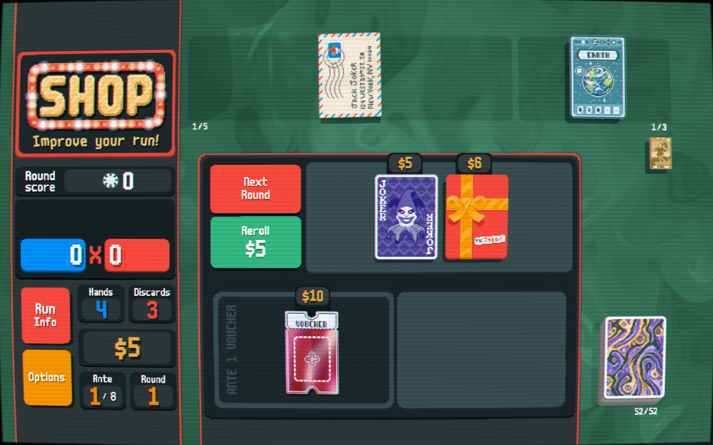

## Requirements
- [Lovely](https://github.com/ethangreen-dev/lovely-injector) - a Balatro injector.

## Installation
1. Install [Lovely](https://github.com/ethangreen-dev/lovely-injector?tab=readme-ov-file#manual-installation).
2. Download the [latest release](https://github.com/luisdiogo98/FoolHelper/releases) of this mod.
3. Unzip the folder, and move it into the `%appdata%/Balatro/Mods` folder.
4. Restart the game to load the mod.

## TL;DR

This mod adds helper for the player to know what was the last player Tarot/Planet card (in order to plan for The Fool) without having to access the Collection menu.

## Features

This mod adds a mini Fool below the Consumables area.

By hovering it, it displays The Fool's tooltip, allowing the player to know what was the last player Tarot/Planet card and its effect.

